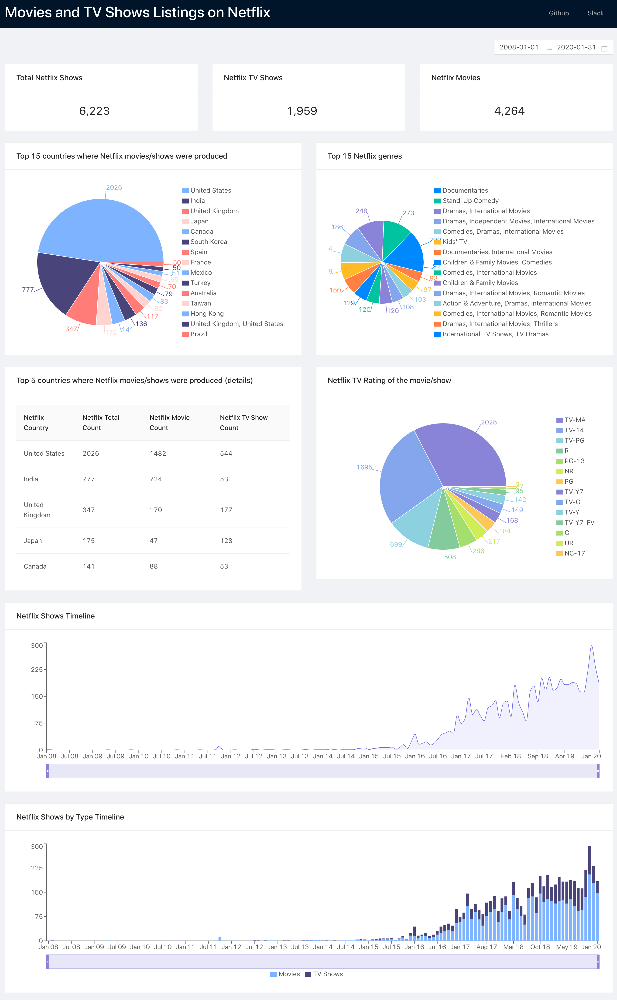

This example is about data visualization on dashboards. I used Ant Design of React, Cube.JS to retrieve data and PostgreSQL as a database. 

If you’re not familiar with Cube.JS yet, please visit [Cube JS Sample React app tutorial](https://cube.dev/blog/cubejs-open-source-dashboard-framework-ultimate-guide/) before continuing this tutorial.

As the start point I used a sample Cube.JS React app.

This is an example of how to render a layer based on [Netflix data](https://www.kaggle.com/shivamb/netflix-shows).



To create the `netflix` database, please, use the following commands.

```javascript
CREATE TABLE public.netflix
(    
show_id bigserial,   
show_type text,
title text,
director text,
leading_role text,
country text,
date_added date,
release_year integer,
rating text,
duration text,
listed_in text,
description text
);
```
and use [netflix_db.sql](./netflix_db.sql) to fill the database 

If you have any feedback or questions about this tutorial or about Cube.js in general — feel free to use our [Slack Cube.js community](http://slack.cube.dev/)